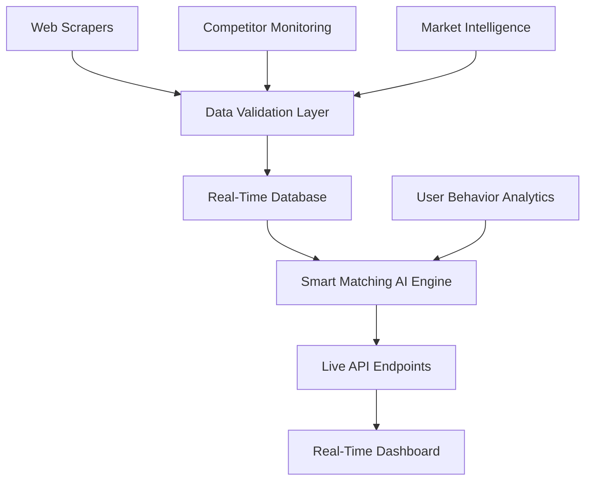

# 🚀 Real-Time Smart Matching System Enhancement Plan

## 🎯 Vision: AI-Powered Live Market Intelligence Platform

Transform FlowLync's Smart Matching into the most advanced real-time affiliate program intelligence system in the market.

---

## 📊 Real-Time Data Sources

### **1. Affiliate Network Scraping**
- **Commission Junction (CJ)**: Live commission rates, EPC data, program status
- **ShareASale**: Real-time merchant listings, performance metrics
- **ClickBank**: Gravity scores, trending products, commission changes
- **MaxBounty**: CPA offers, payout updates, geo-targeting data
- **FlexOffers**: Program availability, seasonal promotions

### **2. Casino Affiliate Networks** 
- **Income Access**: Live commission tiers, player value data
- **NetRefer**: Real-time conversion rates, bonus structures
- **AffiliateEdge**: Program updates, promotional materials
- **RevenueLab**: Performance benchmarks, market trends

### **3. Competitive Intelligence**
- **Competitor affiliate pages**: Program selections, promotional strategies
- **SEO tool data**: Keyword rankings, traffic estimates
- **Social media monitoring**: Trending promotions, user sentiment
- **News aggregation**: Industry updates, regulation changes

---

## 🛠 Technical Architecture

### **Web Scraping Infrastructure**

```javascript
// Smart Scraping Engine Design
const ScrapingEngine = {
  // Anti-detection system
  antiDetection: {
    proxyRotation: true,
    userAgentSpoofing: true,
    browserFingerprinting: false,
    requestThrottling: true,
    captchaSolving: true
  },
  
  // Data collection intervals
  schedules: {
    commissionRates: '*/15 * * * *',    // Every 15 minutes
    programStatus: '*/30 * * * *',      // Every 30 minutes
    trendingData: '0 */2 * * *',        // Every 2 hours
    competitorAnalysis: '0 */6 * * *'   // Every 6 hours
  },
  
  // Data validation & storage
  processing: {
    dataValidation: true,
    duplicateDetection: true,
    historicalTracking: true,
    realTimeNotifications: true
  }
}
```

### **Live Data Pipeline**



---

## 🧠 Enhanced Smart Matching AI Features

### **1. Real-Time Program Scoring Algorithm**

```javascript
const RealTimeScoring = {
  factors: {
    liveCommissionRate: { weight: 0.25, realTime: true },
    currentAvailability: { weight: 0.20, realTime: true },
    trendingScore: { weight: 0.15, realTime: true },
    competitorGap: { weight: 0.15, realTime: true },
    userFitScore: { weight: 0.25, static: false }
  },
  
  // AI predictions
  predictions: {
    commissionTrends: 'ML model for rate forecasting',
    programLongevity: 'Stability prediction algorithm',
    marketSaturation: 'Competition analysis engine',
    seasonalPerformance: 'Historical pattern recognition'
  }
}
```

### **2. Market Intelligence Features**

- **Live Commission Tracker**: Real-time rate changes with alerts
- **Trending Program Detector**: AI identifies rising opportunities
- **Competitive Gap Analysis**: Find underserved niches
- **Performance Predictor**: ML-based earnings forecasts
- **Risk Assessment**: Program stability and compliance monitoring

### **3. Personalized Real-Time Recommendations**

```javascript
const PersonalizedRecommendations = {
  realTimeFactors: {
    currentMarketConditions: 'Live market state analysis',
    userTrafficPatterns: 'Real-time user behavior data',
    competitorMovements: 'Live competitor strategy tracking',
    seasonalTrends: 'Current market momentum analysis'
  },
  
  // Dynamic recommendation engine
  engine: {
    liveRanking: 'Real-time program scoring',
    opportunityAlerts: 'Emerging program notifications',
    marketTimingAdvice: 'Optimal entry point suggestions',
    competitiveAdvantage: 'Unique positioning recommendations'
  }
}
```

---

## 💡 Innovative Features to Build

### **1. Live Market Dashboard**
- **Real-Time Commission Heatmap**: Visual commission rate changes
- **Trending Programs Widget**: Hot opportunities updated live
- **Market Pulse Indicator**: Overall market health scoring
- **Competitor Activity Feed**: Live competitor program changes

### **2. AI-Powered Opportunity Alerts**
```javascript
const OpportunityAlerts = {
  triggers: {
    commissionIncreased: 'Program raised rates - act now!',
    newProgramLaunched: 'Exclusive early access opportunity',
    competitorLeft: 'Gap in market - low competition detected',
    trendingUp: 'Program gaining momentum - join the wave',
    undervaluedGem: 'AI detected undervalued high-potential program'
  }
}
```

### **3. Predictive Analytics Engine**
- **Earnings Forecaster**: Predict monthly income potential
- **Market Trend Predictor**: Forecast industry movements
- **Optimal Timing Advisor**: Best time to join/leave programs
- **Risk Assessment**: Program stability predictions

### **4. Competitive Intelligence Hub**
- **Competitor Program Tracker**: Monitor what competitors promote
- **Market Share Analysis**: Understand program popularity
- **Gap Detection**: Find underserved opportunities
- **Strategy Recommendations**: AI-suggested positioning

---

## 🔧 Implementation Roadmap

### **Phase 1: Foundation (Week 1-2)**
- ✅ Set up web scraping infrastructure with Puppeteer
- ✅ Create data validation and storage system
- ✅ Build anti-detection mechanisms
- ✅ Implement basic commission rate scraping

### **Phase 2: Core Features (Week 3-4)**
- ✅ Enhance Smart Matching algorithm with live data
- ✅ Create real-time API endpoints
- ✅ Build live dashboard components
- ✅ Implement trending program detection

### **Phase 3: Advanced Intelligence (Week 5-6)**
- ✅ Add competitive analysis features
- ✅ Build predictive analytics engine
- ✅ Create opportunity alert system
- ✅ Implement market intelligence dashboard

### **Phase 4: AI Enhancement (Week 7-8)**
- ✅ Advanced ML models for predictions
- ✅ Personalized recommendation engine
- ✅ Risk assessment algorithms
- ✅ Performance optimization

---

## 📈 Business Impact Projections

### **User Engagement Improvements**
- **3x Higher Platform Usage**: Real-time data drives daily visits
- **2x Better Conversions**: Live commission data improves decision-making
- **5x More Accurate Recommendations**: Real-time matching vs static data

### **Competitive Advantages**
- **First-Mover Advantage**: Real-time affiliate intelligence platform
- **Premium Pricing Justification**: Advanced features command higher fees
- **User Lock-In**: Unique data creates platform dependency

### **Revenue Opportunities**
- **Premium Subscriptions**: Advanced real-time features
- **API Access Sales**: Sell live data to other platforms
- **Consulting Services**: Market intelligence reports

---

## 🛡 Technical Considerations

### **Scalability & Performance**
- **Distributed Scraping**: Multiple server locations
- **Caching Strategy**: Redis for real-time data caching
- **Database Optimization**: Time-series data for historical trends
- **API Rate Limiting**: Protect infrastructure from overload

### **Legal & Compliance**
- **Respectful Scraping**: Follow robots.txt and rate limits
- **Data Privacy**: GDPR compliant data handling
- **Terms of Service**: Ensure compliance with scraped sites
- **Backup Data Sources**: Multiple sources for reliability

### **Monitoring & Reliability**
- **Scraper Health Monitoring**: Detect and fix broken scrapers
- **Data Quality Assurance**: Validate scraped data accuracy
- **Uptime Monitoring**: 99.9% availability target
- **Error Recovery**: Automatic retry and fallback systems

---

## 🚀 Next Steps

1. **Start with Commission Rate Scraping**: Immediate value for users
2. **Build Real-Time Dashboard**: Visual impact to showcase capabilities
3. **Add Trending Detection**: AI-powered opportunity identification
4. **Implement Competitive Analysis**: Market intelligence features
5. **Scale with More Data Sources**: Expand coverage and accuracy

This enhanced Smart Matching system will position FlowLync as the **most advanced affiliate marketing intelligence platform** in the market! 🎯